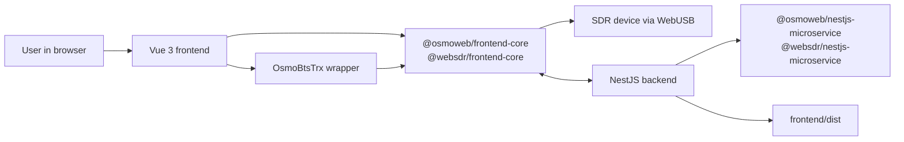
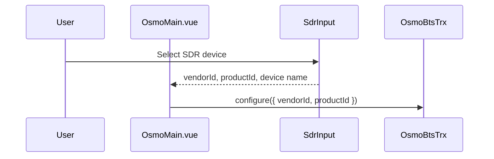
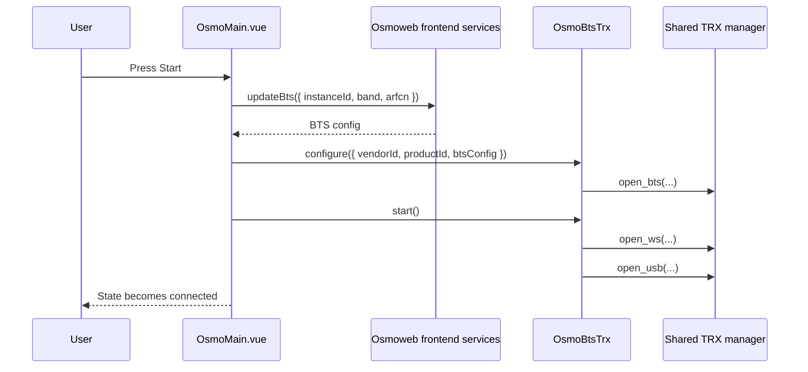
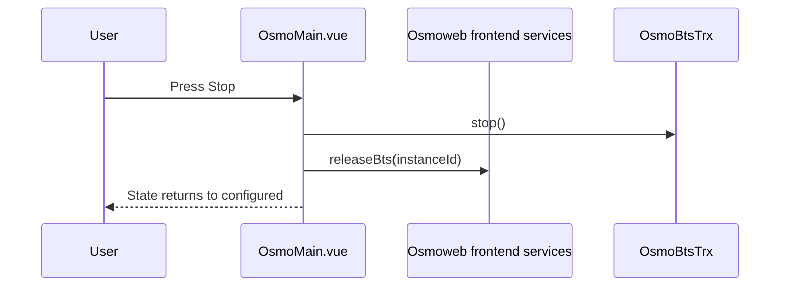
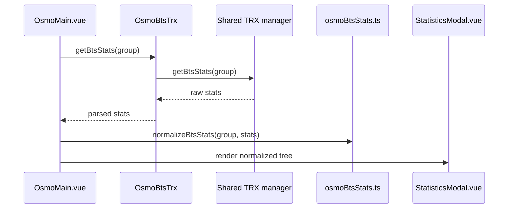

# Architecture Overview

OsmoWeb BTS Demo is split into a small application shell and shared domain packages. This repository owns the demo composition: the NestJS host, the Vue user interface, configuration wiring, and the browser workflow. The lower-level BTS, SDR, WebUSB, WebSocket, authentication, and telemetry behavior is provided by npm packages in the `@osmoweb/*` and `@websdr/*` namespaces.

This application is part of a small set of related repositories:

- [wavelet-lab/osmoweb-app](https://github.com/wavelet-lab/osmoweb-app) - the demo application described here.
- [wavelet-lab/osmoweb](https://github.com/wavelet-lab/osmoweb) - shared OsmoWeb packages.
- [wavelet-lab/websdr](https://github.com/wavelet-lab/websdr) - shared WebSDR packages.
- [wavelet-lab/osmoweb-tools](https://github.com/wavelet-lab/osmoweb-tools) - scripts and configuration for running the Osmo backend services.

## High-Level Shape



## Repository-Owned Parts

The local backend owns:

- NestJS bootstrap and global application setup.
- CORS, logging, validation, cookie parsing, and WebSocket adapter registration.
- Static serving for the compiled frontend.
- Local app controller and service scaffolding.
- Backend module composition for dynamic BTS configuration through shared Osmo services.

The local frontend owns:

- Vue application composition.
- The main BTS control screen.
- Start/stop orchestration around shared frontend services.
- Local `OsmoBtsTrx` wrapper behavior.
- Statistics normalization for display.
- Demo UI styles.

## Shared Package Responsibilities

The shared packages provide most domain-specific behavior.

| Package area | Used for |
| --- | --- |
| `@osmoweb/core` | GSM radio types and ARFCN configuration helpers. |
| `@osmoweb/frontend-core` | BTS service calls and frontend TRX manager integration. |
| `@osmoweb/vue3-components` | BTS UI components such as `BtsInput`. |
| `@osmoweb/nestjs-microservice` | Backend Osmo module integration. |
| `@websdr/core` | Shared utility types such as journal log items. |
| `@websdr/frontend-core` | WebUSB and telemetry runtime support. |
| `@websdr/vue3-components` | SDR input and log UI components. |
| `@websdr/nestjs-microservice` | Backend auth, logging, and related NestJS integrations. |

This repository should document how those packages are used, but it should avoid duplicating their internal implementation details.

## Backend Runtime

The backend starts from `backend/src/main.ts` and creates `AppModule.withLogging(...)`.

Runtime responsibilities:

1. Apply logger levels from `LOG_LEVELS` or `LOG_LEVEL`.
2. Create the NestJS application.
3. Load environment values through `ConfigService`.
4. Register cookie parsing and global validation.
5. Register `WsAdapter` for WebSocket support.
6. Configure CORS according to `NODE_ENV`, `CORS_ALLOW_ALL`, and `CORS_ORIGIN`.
7. Listen on `PORT`, defaulting to `4000`.

The root module mounts:

- `AuthModule`
- `LoggingModule`
- `OsmoModule`
- `ServeStaticModule`

The local `GET /api/hello` endpoint is a small guarded example route. BTS-specific API and WebSocket behavior is expected to come from the shared Osmo backend module.

## Frontend Runtime

The frontend starts from `frontend/src/main.ts`, mounts `App.vue`, and renders the main BTS workflow through `OsmoMain.vue`.

`OsmoMain.vue` coordinates:

- `SdrInput` for WebUSB device selection.
- `BtsInput` for GSM BTS configuration.
- `BtsControlPanel` for start/stop and traffic metrics.
- `LogArea` for journal log output.
- `StreamMeter` for traffic and cloud connection telemetry.
- `OsmoBtsTrx` for TRX runtime actions.
- `normalizeBtsStats(...)` for statistics display.

## Main Data Flows

### Device Selection



### BTS Start



### BTS Stop And Release



The same release path is also triggered when the page is hidden or the component is unmounted while a BTS session is running.

### Statistics Polling

While the BTS state is `connected`, the frontend polls statistics every two seconds.



Current groups:

```ts
['stats', 'rate-counters', 'bts', 'trx', 'transceiver', 'websdr']
```

### Logging

The shared TRX manager emits journal log items through callbacks. `OsmoBtsTrx` forwards those items through `onLogItem`, and `OsmoMain.vue` appends them to `LogArea`.

Subsystem names are collected as logs arrive and are exposed to the log component as filter options.

## State Model

The frontend uses the BTS state from `@osmoweb/vue3-components`.

Important local states:

| State | Meaning in this app |
| --- | --- |
| `configured` | A valid radio configuration exists, but the BTS runtime is not running. |
| `connected` | The BTS runtime has been started successfully. |
| `disconnected` | A start/stop action failed or runtime connection was lost. |
| `not-configured` | A placeholder state supported by the UI contract; the current default flow starts with a valid config. |

Additional local flags:

- `osmoBusy` disables controls while start/stop is in progress.
- `osmoError` stores the latest runtime error message.
- `cloudConnected` mirrors stream telemetry state.

## Build And Serving Model

During development, Vite serves the frontend and can proxy `/api` to the backend.

For built output:

1. `npm run build --prefix frontend` emits `frontend/dist`.
2. `npm run build --prefix backend` emits backend JavaScript to `backend/dist`.
3. The backend serves `frontend/dist` through `ServeStaticModule`.
4. API and auth paths remain excluded from static serving.

## Extension Points

Common extension areas:

- Add new local backend controllers for app-specific API endpoints.
- Add new frontend panels around existing telemetry or BTS statistics.
- Expand `osmoBtsStats.ts` when new statistics shapes are introduced.
- Add configuration documentation for new environment variables.
- Replace the demo `GET /api/hello` route with real application-specific endpoints.

When adding behavior that belongs to shared BTS, SDR, or authentication logic, prefer implementing it in the corresponding `@osmoweb/*` or `@websdr/*` package and documenting only the integration point here.
