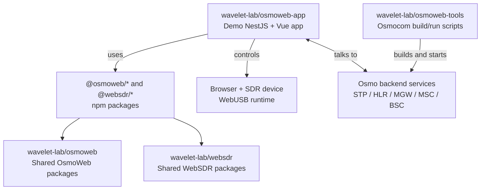

# Getting Started

This guide walks through setting up the OsmoWeb BTS demo on a local machine. It covers the required repositories, building or running the Osmocom backend services, building `osmoweb-app`, and starting the full demo.

## 🌍 Hosted Demo

A hosted demo build is available at [app.websdr.io](https://app.websdr.io).

Use the hosted demo for a quick look at the browser application. For a full local setup with your own Osmo backend services, SDR device, logs, and development workflow, follow the steps below.

## 🧭 Repository Map

The demo is composed from several related repositories and npm packages:



| Repository | What it contains |
| --- | --- |
| [`wavelet-lab/osmoweb-app`](https://github.com/wavelet-lab/osmoweb-app) | This demo web application: NestJS backend, Vue frontend, and documentation. |
| [`wavelet-lab/osmoweb`](https://github.com/wavelet-lab/osmoweb) | Shared OsmoWeb packages used by the demo backend and frontend. |
| [`wavelet-lab/websdr`](https://github.com/wavelet-lab/websdr) | Shared WebSDR packages for SDR, WebUSB, telemetry, and UI components. |
| [`wavelet-lab/osmoweb-tools`](https://github.com/wavelet-lab/osmoweb-tools) | Helper scripts, Docker support, and Osmocom service configuration for the Osmo backend services. |

More details:

- [Architecture overview](architecture.md)
- [Runtime flows](runtime-flows.md)
- [User guide](user-guide.md)

## ✅ Prerequisites

Install the following tools before starting:

- Git
- Node.js and npm
- A supported Chromium-based browser with WebUSB support
- An SDR device supported by your runtime setup
- Either native build dependencies for Osmocom or Docker with Docker Compose

For app-specific ports and environment variables, see the [Configuration guide](configuration.md).

## ① Clone `osmoweb-tools`

Clone the helper repository:

```sh
git clone https://github.com/wavelet-lab/osmoweb-tools.git
cd osmoweb-tools
```

`osmoweb-tools` provides:

- native scripts for building and running Osmocom services
- Docker-based build/run support
- log watching helpers
- VTY control helpers
- `ws-udp-proxy` utilities

Full upstream documentation:

- [`osmoweb-tools` README](https://github.com/wavelet-lab/osmoweb-tools)
- [`Docker Osmo`](https://github.com/wavelet-lab/osmoweb-tools#docker-osmo)
- [`Build Osmo components`](https://github.com/wavelet-lab/osmoweb-tools#build-osmo-components)
- [`Start Osmo services`](https://github.com/wavelet-lab/osmoweb-tools#start-osmo-services)

## ② Prepare The Osmo Backend

Choose one of the following setup paths.

### 🛠️ Option A ─ Native Build

Use this path when you want Osmocom binaries installed and run directly on the host.

Build the Osmo components:

```sh
./scripts/build_osmo.sh
```

Useful variants:

```sh
# Force rebuild
./scripts/build_osmo.sh -f

# Build with generated documentation
./scripts/build_osmo.sh -d

# Build into a custom path
./scripts/build_osmo.sh -p /opt/osmo
```

The script detects the package manager and installs the required development packages for supported Linux distributions.

More details:

- [`Build Osmo components`](https://github.com/wavelet-lab/osmoweb-tools#build-osmo-components)

### 🐳 Option B ─ Docker Build

Use this path when you want to run the Osmocom backend in Docker without installing Osmocom libraries and binaries on the host.

Build the Docker image:

```sh
./scripts/docker_osmo.sh build
```

Useful variants:

```sh
# Build image with documentation tools
./scripts/docker_osmo.sh -d build

# Use a custom host data path
./scripts/docker_osmo.sh -p ./osmo build
```

More details:

- [`Docker Osmo`](https://github.com/wavelet-lab/osmoweb-tools#docker-osmo)

## ③ Clone `osmoweb-app`

Move to the directory where you keep projects, then clone the web demo:

```sh
git clone https://github.com/wavelet-lab/osmoweb-app.git
cd osmoweb-app
```

Install dependencies:

```sh
npm install
```

More details:

- [Development guide](development.md)
- [Frontend documentation](frontend.md)
- [Backend documentation](backend.md)

## ④ Build `osmoweb-app`

Build both the frontend and backend packages:

```sh
npm run build
```

Build output:

```text
frontend/dist  ─ built Vue frontend
backend/dist   ─ compiled NestJS backend
```

The compiled backend serves the built frontend from `frontend/dist`.

More details:

- [Development guide: Production-Style Build](development.md#production-style-build)
- [Configuration guide: Static Frontend Serving](configuration.md#static-frontend-serving)

## ⑤ Start The Demo

The demo needs two runtime layers:

```text
1. Osmo backend services  ─ Osmocom STP/HLR/MGW/MSC/BSC services
2. osmoweb-app           ─ NestJS backend serving the Vue frontend
```

### 📡 Start The Osmo Backend

If you used the native setup:

```sh
cd /path/to/osmoweb-tools
./scripts/start_osmo.sh
```

Optional native startup with BTS and TRX:

```sh
./scripts/start_osmo.sh -b -t usdr
```

If you used the Docker setup:

```sh
cd /path/to/osmoweb-tools
./scripts/docker_osmo.sh start
```

Optional Docker startup with BTS:

```sh
./scripts/docker_osmo.sh -b start
```

Follow Osmo logs:

```sh
# Native setup
./scripts/watch_osmo_logs.sh

# Docker setup
./scripts/docker_osmo.sh logs
```

More details:

- [`Start Osmo services`](https://github.com/wavelet-lab/osmoweb-tools#start-osmo-services)
- [`Watch Osmo logs`](https://github.com/wavelet-lab/osmoweb-tools#watch-osmo-logs)
- [`Docker Osmo`](https://github.com/wavelet-lab/osmoweb-tools#docker-osmo)

### 🌐 Start `osmoweb-app`

From the `osmoweb-app` repository root:

```sh
npm run start
```

This starts the compiled NestJS backend and serves the built Vue frontend from the same server.

Open:

```text
http://localhost:4000
```

More details:

- [Development guide](development.md)
- [User guide](user-guide.md)

## 🔁 Development Mode Alternative

For development, run backend and frontend separately so Vite can provide hot reload.

Terminal 1:

```sh
cd osmoweb-app
npm run build --prefix backend
npm run start --prefix backend
```

Terminal 2:

```sh
cd osmoweb-app
npm run build --prefix frontend
npm run dev --prefix frontend
```

Open:

```text
http://localhost:4000
```

More details:

- [README Development section](../README.md#development)
- [Development guide](development.md)
- [Configuration guide](configuration.md)

## ⏹️ Stop Services

Stop the web app with `Ctrl+C` in its terminal.

Stop native Osmo services:

```sh
cd /path/to/osmoweb-tools
./scripts/stop_osmo.sh
```

Stop Docker Osmo services:

```sh
cd /path/to/osmoweb-tools
./scripts/docker_osmo.sh stop
```

## ✅ Quick Checklist

```text
✓ Clone osmoweb-tools
✓ Build Osmo backend natively or with Docker
✓ Clone osmoweb-app
✓ Run npm install
✓ Run npm run build
✓ Start Osmo backend services
✓ Start osmoweb-app
✓ Open http://localhost:4000
```

## 🧯 Troubleshooting Links

- [Development guide: Troubleshooting](development.md#troubleshooting)
- [User guide: Common Problems](user-guide.md#common-problems)
- [`osmoweb-tools` README](https://github.com/wavelet-lab/osmoweb-tools)
