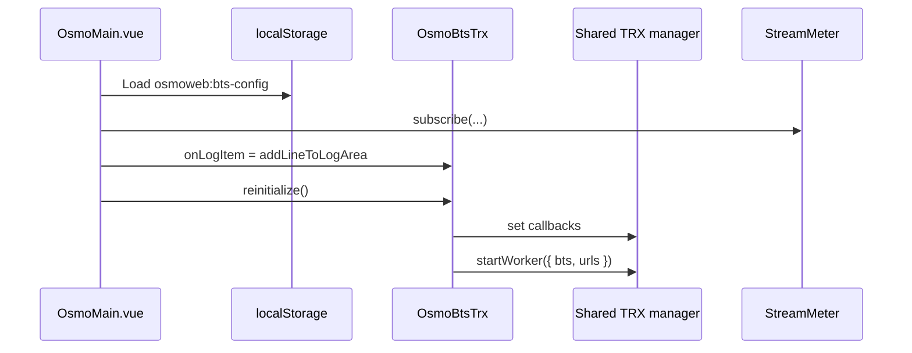
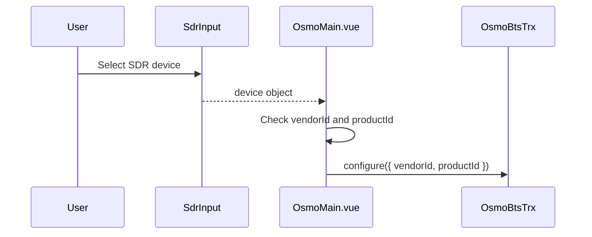
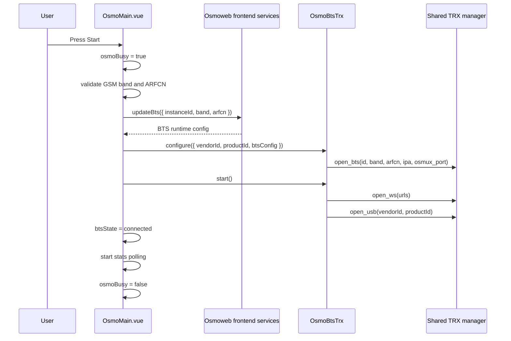
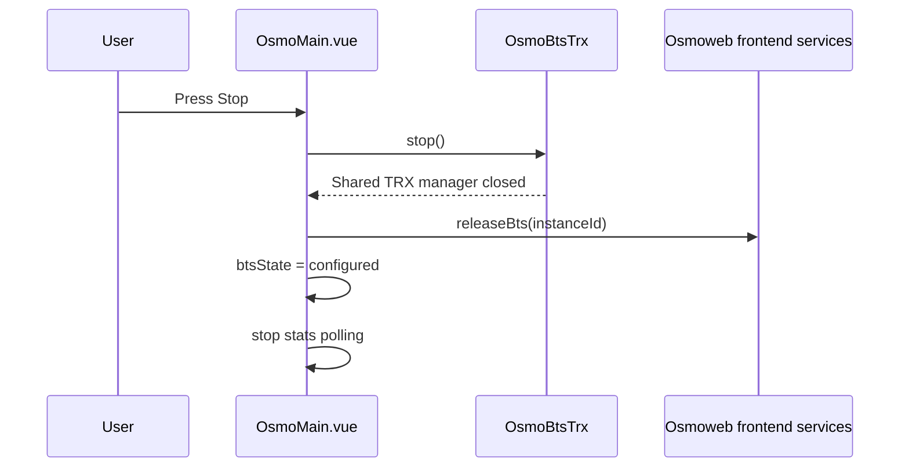

# Runtime Flows

This document describes the main runtime flows in the OsmoWeb BTS Demo. It focuses on what happens in the browser UI and how the local frontend wrapper coordinates shared Osmo/WebSDR services.

## Main Runtime Owners

| Owner | Responsibility |
| --- | --- |
| `OsmoMain.vue` | Owns UI state, user actions, polling, telemetry subscription, and cleanup. |
| `OsmoBtsTrx` | Wraps the shared TRX manager and exposes local methods for configure/start/stop/stats. |
| `@osmoweb/frontend-core/services` | Provides BTS allocation/update and release service calls. |
| `@osmoweb/frontend-core/osmo` | Provides the shared TRX manager instance. |
| `@websdr/frontend-core/telemetry` | Provides `StreamMeter` telemetry state. |
| `@websdr/vue3-components` | Provides SDR input and log UI components. |
| `@osmoweb/vue3-components` | Provides BTS input UI components and BTS state types. |

## Initial Page Load

When `OsmoMain.vue` is created, it initializes runtime state before the component is mounted.

Initial setup:

1. Create a `StreamMeter` instance.
2. Create a single `OsmoBtsTrx` wrapper and pass the stream meter into it.
3. Create a tab-specific `btsInstanceId`.
4. Load the stored radio selection from `localStorage`.
5. Fall back to GSM EGSM 900 / ARFCN 975 when stored data is missing or invalid.
6. Initialize BTS state as `configured`.

On mount:

1. Subscribe to stream meter updates.
2. Connect `OsmoBtsTrx.onLogItem` to the local log handler.
3. Register the `pagehide` cleanup handler.
4. Call `osmoBtsTrx.reinitialize()`.

`reinitialize()` connects callbacks on the shared TRX manager and starts the worker with the current BTS and WebSocket URL values.



## Radio Configuration Flow

The radio configuration is edited through `BtsInput`.

When the user updates the BTS input:

1. `BtsInput` emits an `update` event.
2. `handleBtsUpdate(...)` receives the new `BtsParams`.
3. The new value is assigned to `btsConfig`.
4. A reduced version is saved to `localStorage`.
5. `btsState` is set to `configured`.

Only valid GSM selections are stored:

- `technology`
- `band`
- `arfcn`

The current start flow supports GSM only. `getBtsUpdatePayload()` rejects unsupported technology, missing band, or missing ARFCN before calling the shared service layer.

## Device Selection Flow

The SDR device is selected through `SdrInput`.

When the selected device changes:

1. The `device` ref receives `devName`, `vendorId`, and `productId`.
2. A watcher checks whether both IDs are non-zero.
3. `OsmoBtsTrx.configure(...)` stores the USB IDs.
4. If configuration fails, `osmoError` is updated.



## Start Flow

The Start button is enabled only when:

- BTS state is not `not-configured`
- a device is selected
- no start/stop operation is already in progress

When the user starts the BTS runtime:

1. `handleBtsToggle()` sets `osmoBusy` to `true`.
2. The previous `osmoError` is cleared.
3. `getBtsUpdatePayload()` validates GSM technology, band, and ARFCN.
4. `updateBts(...)` is called with `instanceId`, `band`, and `arfcn`.
5. The returned BTS runtime config is passed to `OsmoBtsTrx.configure(...)`.
6. `OsmoBtsTrx.configure(...)` stores USB IDs and opens the BTS in the shared TRX manager.
7. `OsmoBtsTrx.start()` opens WebSocket transport and the selected USB device.
8. `btsState` becomes `connected`.
9. The `btsRunning` watcher starts statistics polling.
10. `osmoBusy` returns to `false`.



## Stop Flow

When the BTS is already running, the same control button stops it.

Stop sequence:

1. `handleBtsToggle()` detects that `btsRunning` is `true`.
2. `stopAndReleaseBts()` calls `OsmoBtsTrx.stop()`.
3. `OsmoBtsTrx.stop()` closes the shared TRX manager.
4. `releaseCurrentBts()` calls `releaseBts(instanceId)`.
5. `btsState` returns to `configured`.
6. The `btsRunning` watcher stops statistics polling and clears stored stats.



## Error Flow

Start and stop actions share the same error handling path.

When an error is thrown:

1. `osmoError` is set to the error message.
2. `btsState` becomes `disconnected`.
3. The error is logged to the browser console.
4. `osmoBusy` returns to `false` in the `finally` block.

The control panel includes the error value in its statistics object, so it can be inspected from the statistics modal.

## Statistics Polling Flow

Statistics polling is controlled by the computed `btsRunning` value.

When `btsRunning` changes to `true`:

1. Existing polling is stopped.
2. `refreshBtsStats()` runs immediately.
3. A two-second interval is created.

When `btsRunning` changes to `false`:

1. The interval is cleared.
2. `osmoBtsStats` is reset to an empty object.

Polled groups:

```ts
['stats', 'rate-counters', 'bts', 'trx', 'transceiver', 'websdr']
```

For each group:

1. `OsmoBtsTrx.getBtsStats(group)` calls the shared TRX manager.
2. String responses are parsed as JSON when possible.
3. `normalizeBtsStats(group, value)` converts the raw structure into a display-friendly tree.
4. Failed groups are represented by their error message.
5. `StatisticsModal` renders the final nested object.

## Telemetry Flow

`StreamMeter` provides traffic and cloud connection state.

On every stream meter update:

| Stream meter field | Local UI field |
| --- | --- |
| `cloud_is_up` | `cloudConnected` |
| `downloaded` | `rxBytesReceived` |
| `uploaded` | `txBytesSent` |
| `wr_ahead_avg` | `txLagSamples` |

These values are displayed in `BtsControlPanel` and included in the statistics modal data.

## Log Flow

Log callbacks are attached during `OsmoBtsTrx.reinitialize()`.

Log sequence:

1. The shared TRX manager emits a `JournalLogItem`.
2. `OsmoBtsTrx.onLog(...)` receives it.
3. `OsmoBtsTrx.onLog(...)` calls `onLogItem`.
4. `OsmoMain.vue` appends the item to `LogArea`.
5. The log item's subsystem is added to the subsystem filter list if it has not been seen before.

`onWriteLog(...)` and `onChangeParameter(...)` currently log only in debug mode.

## Page Hide And Unmount Cleanup

The app performs cleanup in two cases.

On `pagehide`:

1. If the BTS is not running, no action is taken.
2. If the BTS is running, `OsmoBtsTrx.stop()` is called.
3. `releaseCurrentBts()` releases the active instance.

On component unmount:

1. Unsubscribe from `StreamMeter`.
2. Stop statistics polling.
3. Remove the `pagehide` event listener.
4. Clear `onLogItem`.
5. Release the current BTS if it is still running.
6. Call `OsmoBtsTrx.destroy()`.

`destroy()` stops the shared TRX manager and stops the worker.

## State Transitions

Typical state transitions:

```text
configured -> connected -> configured
configured -> disconnected
disconnected -> connected
```

The `not-configured` state is supported by the UI contract, but the current default flow starts with a valid GSM configuration.

Control disabling:

| Condition | Effect |
| --- | --- |
| `osmoBusy` | Disables BTS control and inputs. |
| no selected device | Disables start/stop control. |
| `btsRunning` | Disables SDR and BTS input controls. |
| `btsState === 'not-configured'` | Disables start/stop control. |

## Local Persistence

The frontend persists only the radio selection needed to recreate `BtsParams`.

Storage key:

```text
osmoweb:bts-config
```

Persisted fields:

- `technology`
- `band`
- `arfcn`

The runtime BTS allocation returned by `updateBts(...)` is not persisted by this local app. It is requested again when the user starts the BTS runtime.
