# User Guide

This guide is a user-facing walkthrough for the OsmoWeb BTS Demo. It describes the visible browser workflow and the main controls used to configure, start, monitor, and stop the BTS runtime.

## Before You Start

Make sure that:

- the backend is running
- the Osmo backend services are running through the scripts from [`wavelet-lab/osmoweb-tools`](https://github.com/wavelet-lab/osmoweb-tools)
- an SDR device is connected
- the frontend is open in a supported browser (Chrome, Edge, or other Chromium-based browser)
- the browser supports WebUSB
- browser permission prompts are allowed

Start the Osmo backend services from the `osmoweb-tools` repository before using the web UI:

```sh
cd /path/to/osmoweb-tools/scripts
./start_osmo.sh
```

Expected startup output looks similar to this:

```text
user@comp:/path/to/osmoweb-tools/scripts$ ./start_osmo.sh
Using system binaries
Osmo path: /path/to/osmoweb-tools/scripts/osmo
Config path: /path/to/osmoweb-tools/scripts/osmo/config
Log path: /path/to/osmoweb-tools/scripts/osmo/logs
INFO    Checking for conflicting old libraries:
SUCCESS No library conflicts detected
Checking osmo binaries and configs:
SUCCESS osmo-stp found at /usr/local/bin/osmo-stp
SUCCESS osmo-hlr found at /usr/local/bin/osmo-hlr
SUCCESS osmo-mgw found at /usr/local/bin/osmo-mgw
SUCCESS osmo-msc found at /usr/local/bin/osmo-msc
SUCCESS osmo-bsc found at /usr/local/bin/osmo-bsc
Starting osmo services...
INFO    Starting osmo-stp...
INFO    Starting osmo-hlr...
INFO    Starting osmo-mgw...
INFO    Starting osmo-msc...
INFO    Starting osmo-bsc...
SUCCESS All osmo services started. Logs are being written to /path/to/osmoweb-tools/scripts/osmo/logs
```

To inspect the Osmo service logs, run:

```sh
cd /path/to/osmoweb-tools/scripts
./watch_osmo_logs.sh
```

The log watcher prints entries from services such as `osmo-bsc`, `osmo-hlr`, `osmo-mgw`, `osmo-msc`, `osmo-stp`, `osmo-bts-trx`, and `osmo-trx-usdr`.

Example log watcher output:

```text
user@comp:/path/to/osmoweb-tools/scripts$ ./watch_osmo_logs.sh
Watching log files in: /path/to/osmoweb-tools/scripts/osmo/logs
==> /path/to/osmoweb-tools/scripts/osmo/logs/osmo-hlr.log <==
DMAIN NOTICE hlr starting (hlr.c:817)
DLGLOBAL NOTICE Available via telnet 127.0.0.1 4258 (telnet_interface.c:88)
DLCTRL NOTICE CTRL at 127.0.0.1 4259 (control_if.c:1026)

==> /path/to/osmoweb-tools/scripts/osmo/logs/osmo-mgw.log <==
DLGLOBAL NOTICE Available via telnet 127.0.0.1 4243 (telnet_interface.c:88)
DLCTRL NOTICE CTRL at 127.0.0.1 4267 (control_if.c:1026)
DLMGCP NOTICE Configured for MGCP, listen on 127.0.0.1:2427 (mgw_main.c:412)

==> /path/to/osmoweb-tools/scripts/osmo/logs/osmo-msc.log <==
DSGS NOTICE SGs socket bound to r=NULL<->l=0.0.0.0:29118 (sgs_server.c:186)
DMSC NOTICE A-interface: SCCP user OsmoMSC-A initialized
```

Some service logs may include NOTICE or ERROR lines while devices and transceivers are starting, stopping, or reconnecting. Interpret them together with the web UI state and the runtime log area.

When the app opens, it performs an automatic login. While this is happening, the page shows:

```text
Logging in...
```

If login fails, the page shows:

```text
Login failed: <error>
```

## Main Screen

After login, the main screen shows the Osmo BTS control interface.

The screen contains:

- page header with `Osmo Main`
- theme toggle
- SDR device selector
- BTS radio configuration input
- `BTS Control` panel
- runtime log area

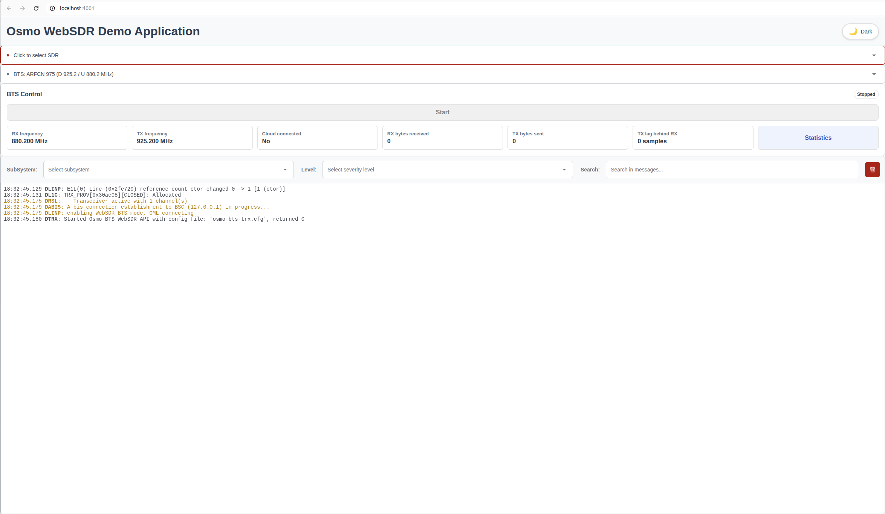

## Select An SDR Device

Use the SDR device selector to choose the connected device.

After a device is selected, the app stores its USB vendor and product IDs for the current runtime session. The BTS Start button remains disabled until a valid device is selected.

If the browser asks for permission to access the USB device, approve the prompt.

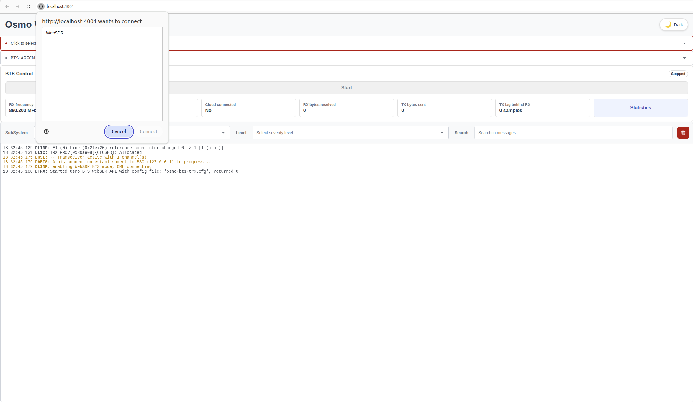

After a device is selected, its name is shown in the SDR input.

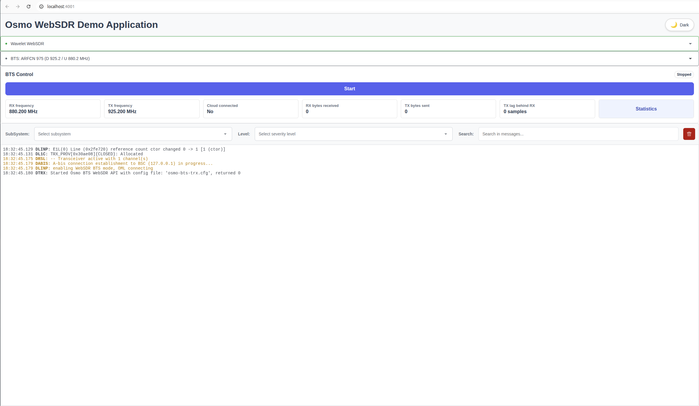

## Configure BTS Radio Settings

Use the BTS input to select the GSM radio configuration.

The current demo supports GSM BTS configuration. The app validates:

- radio technology
- GSM band
- ARFCN

The default configuration is GSM EGSM 900 with ARFCN 975. When a valid radio configuration is changed, it is saved locally in the browser and restored on the next page load.

Select the GSM band first.

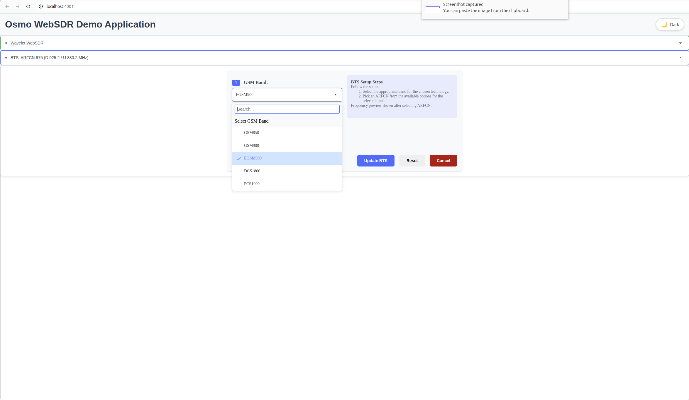

Then select or enter the ARFCN value.

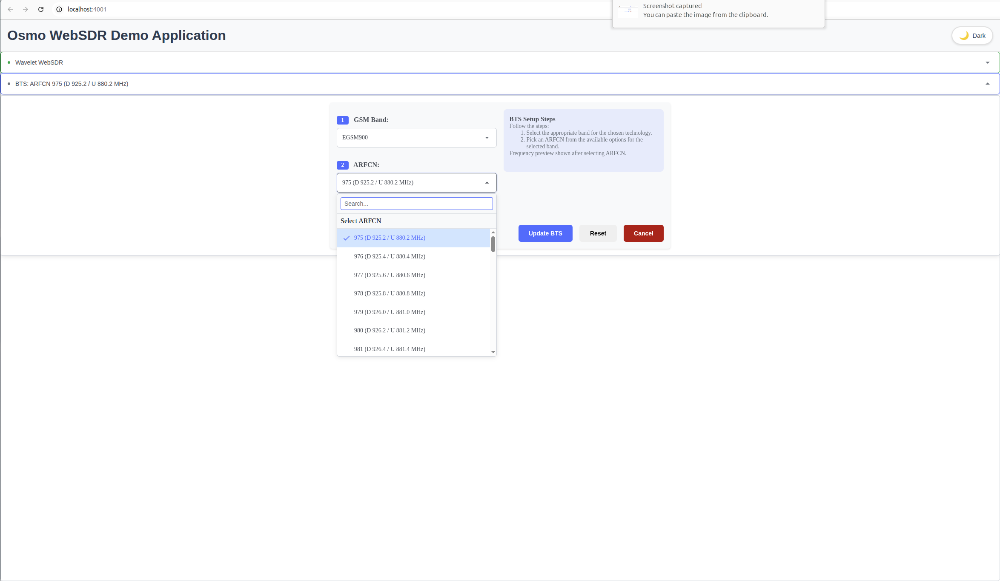

Before starting the BTS, make sure that the selected ARFCN maps to uplink and downlink frequencies that are free in your local test environment. If another signal or device is already using one of those frequencies, phones may fail to see the BTS or fail to attach to it.

## Start The BTS Runtime

After selecting an SDR device and confirming the BTS radio configuration, press `Start` in the `BTS Control` panel.

During startup, the app:

1. validates the selected GSM band and ARFCN
2. requests a dynamic BTS runtime configuration
3. opens the BTS in the TRX runtime
4. opens WebSocket transport
5. opens the selected USB device
6. changes the BTS status to `Running`

While the BTS is running, the SDR and BTS inputs are disabled to prevent changing runtime-critical settings mid-session.

Before startup, the `BTS Control` panel shows the stopped state and the `Start` button.


After startup, the panel changes to the running state and the button changes to `Stop`.

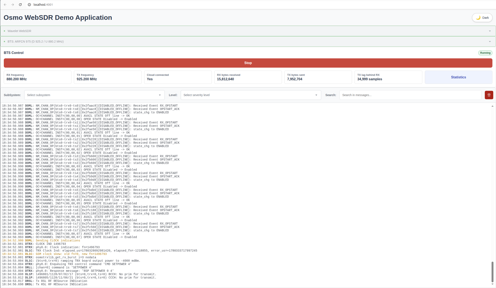

## Monitor Runtime Metrics

The `BTS Control` panel displays live runtime values:

| Metric | Meaning |
| --- | --- |
| `RX frequency` | Current receive frequency derived from the BTS configuration. |
| `TX frequency` | Current transmit frequency derived from the BTS configuration. |
| `Cloud connected` | Whether the stream telemetry reports cloud connectivity. |
| `RX bytes received` | Number of received bytes reported by telemetry. |
| `TX bytes sent` | Number of transmitted bytes reported by telemetry. |
| `TX lag behind RX` | Average TX lag behind RX in samples. |

These values update while the runtime is active.

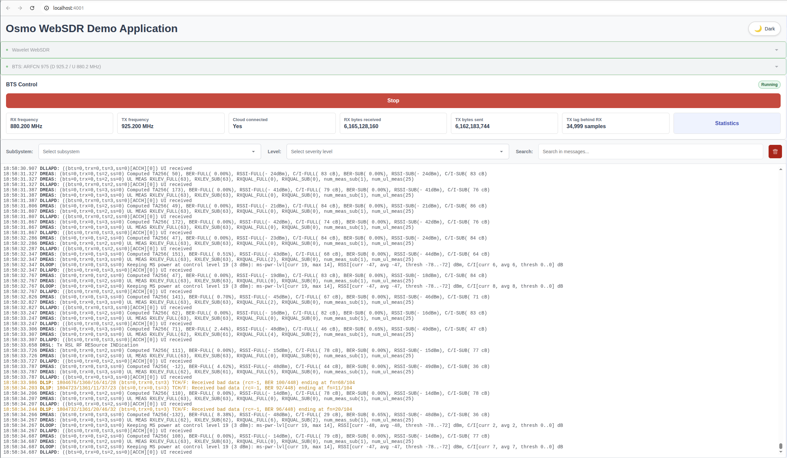

## View BTS Statistics

Press `Statistics` in the `BTS Control` panel to open the statistics modal.

The modal shows a nested tree of runtime statistics. Top-level data includes:

- BTS state
- selected device
- radio settings
- traffic counters
- Osmo BTS statistics groups

Statistics are polled while the BTS runtime is running. If the BTS is stopped, the runtime statistics are cleared.

Use expandable groups in the modal to inspect deeper values.

The state section shows high-level runtime, device, radio, and traffic values.

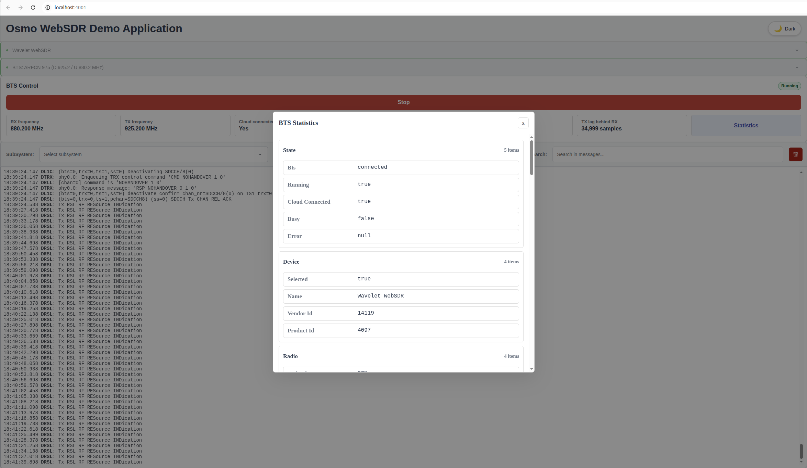

Expand nested groups to inspect more detailed BTS statistics.

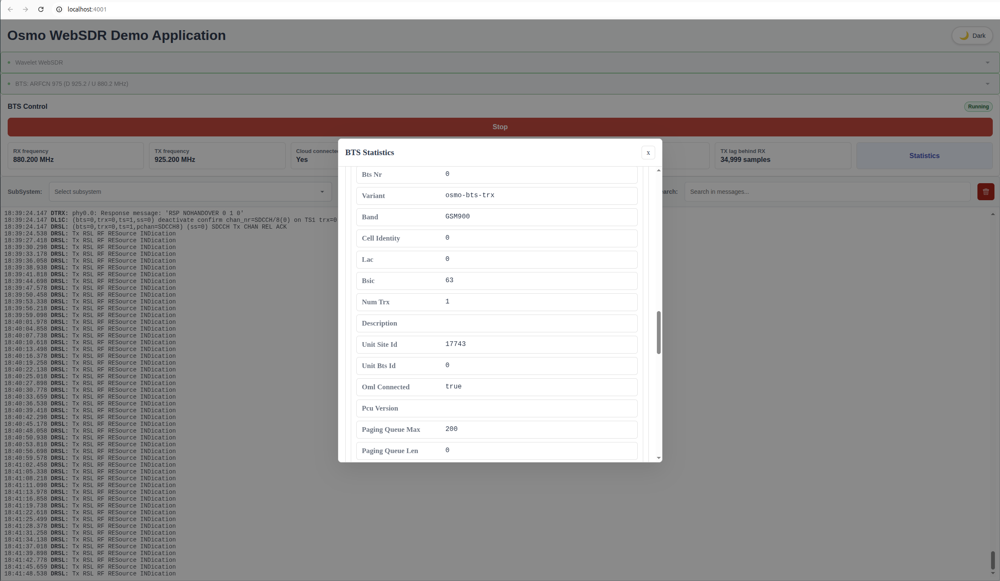

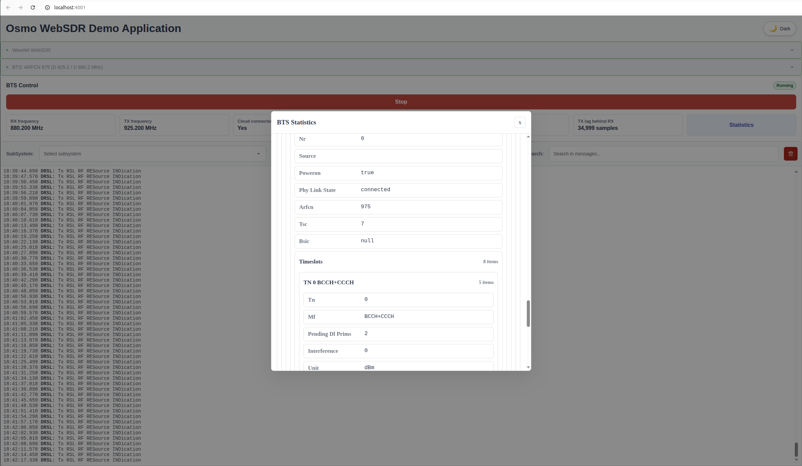

## Read Runtime Logs

The log area displays journal log items emitted by the runtime.

As logs arrive, their subsystem names are collected and exposed as filter options by the log component. Use the log area to inspect startup, connection, runtime, and error messages.


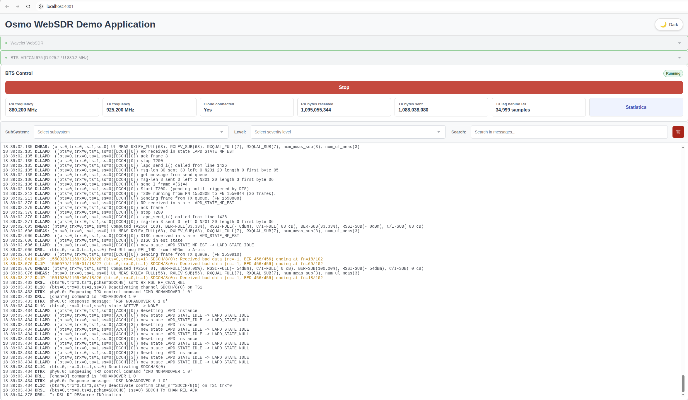

The log area can also show runtime activity such as calls or USSD-related messages.


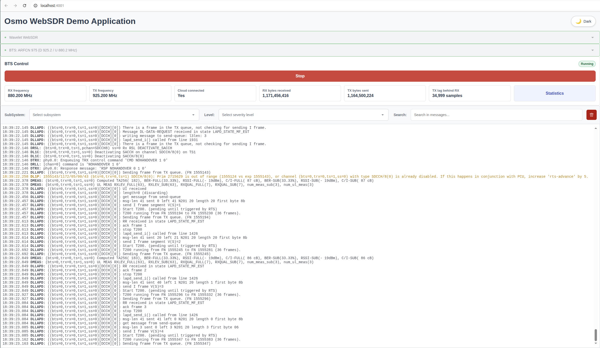

Use filters to narrow the log output by level, subsystem, or search text.

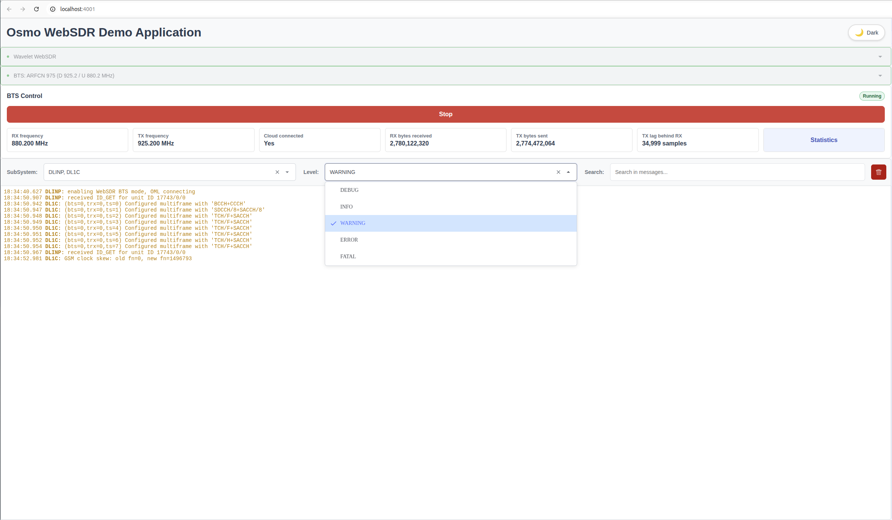

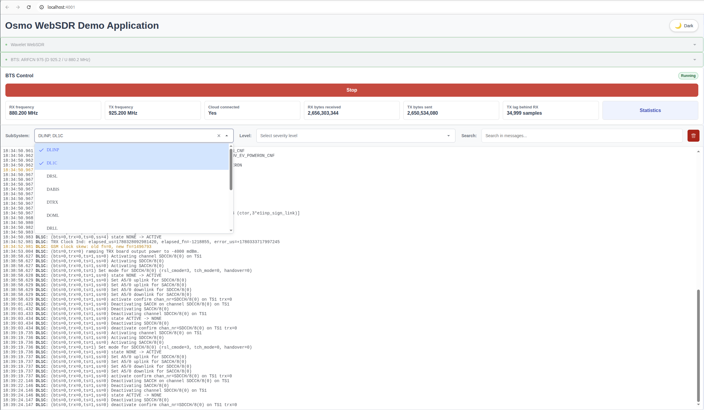

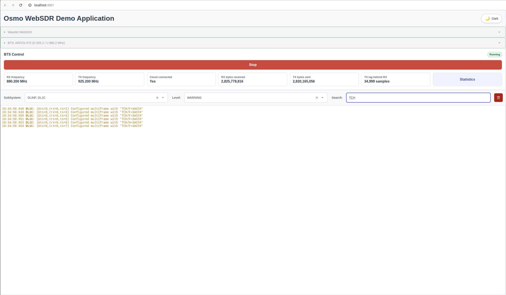

## Stop The BTS Runtime

When the BTS is running, the main control button changes to `Stop`.

Press `Stop` to end the runtime session. The app:

1. closes the TRX runtime
2. releases the dynamic BTS instance
3. changes the status back to `Stopped`
4. stops statistics polling
5. clears runtime statistics

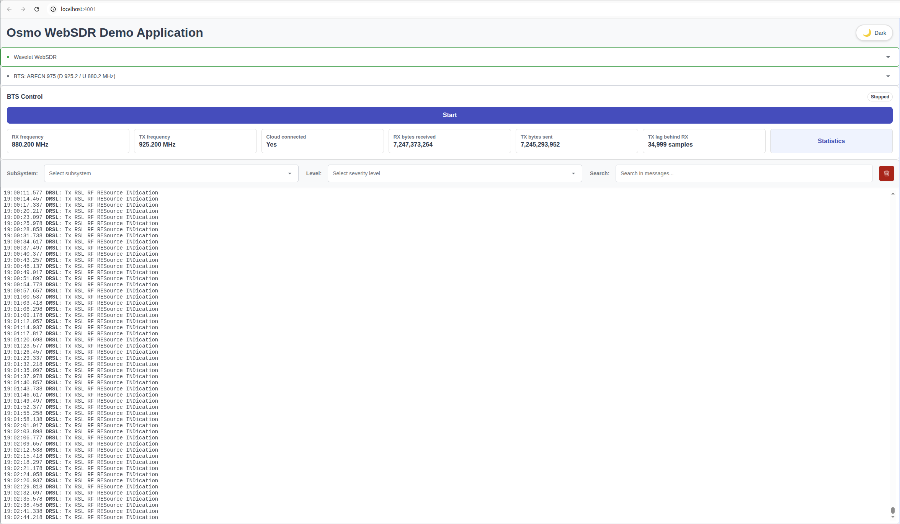

## Closing Or Leaving The Page

If the page is hidden or closed while the BTS is running, the app attempts to stop the runtime and release the active BTS instance.

This cleanup is automatic, but it is still best to press `Stop` before closing the page when possible.

## Theme Toggle

Use the theme toggle in the page header to switch the UI theme.

The light theme uses a brighter background and higher contrast for daytime use.

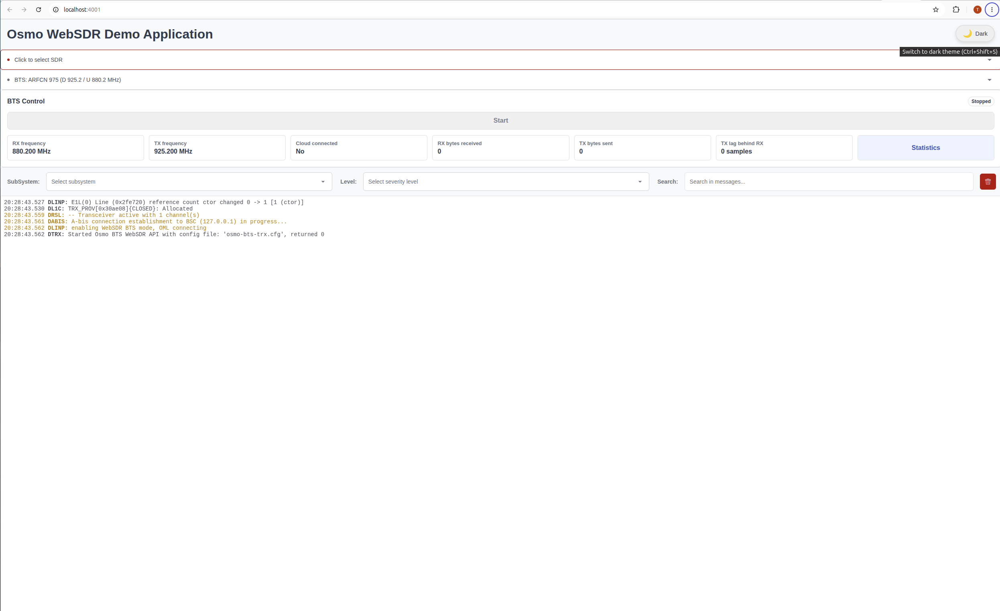

The dark theme uses a darker background for lower-light environments.

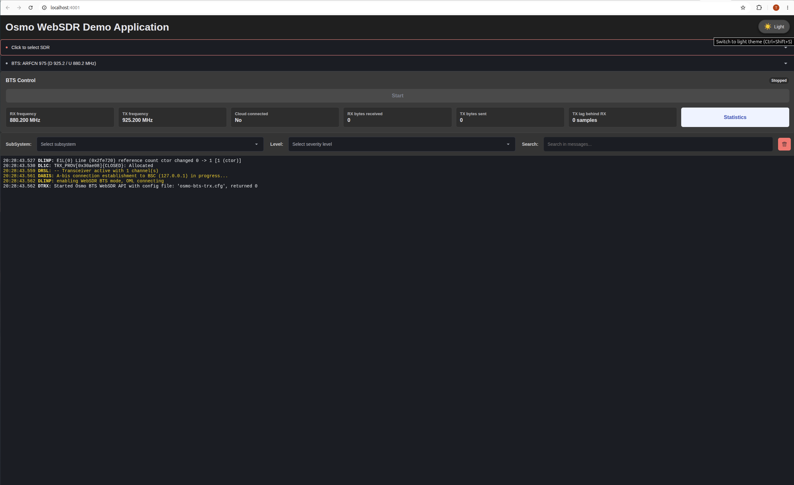

## Common Problems

### Start Button Is Disabled

Check that:

- an SDR device is selected
- BTS state is not `Not configured`
- the app is not already starting or stopping the runtime

### Browser Does Not Show The USB Device

Check that:

- the device is connected
- the browser supports WebUSB
- the page is running in a secure browser context
- browser USB permissions were accepted
- no other application is using the device

### Statistics Are Empty

Statistics are available only while the BTS runtime is running. Start the BTS first, then open the statistics modal.

### Login Failed

Check that the backend is running and that the frontend API base URL points to the backend.

### Runtime Fails To Start

Check:

- the selected device is valid
- the selected technology is GSM
- a GSM band is selected
- ARFCN is selected
- the selected ARFCN maps to free uplink and downlink frequencies
- backend and WebSocket services are reachable
- browser permissions were granted

Error details may appear in the browser console, the statistics modal state section, or the runtime log area.

### Phone Does Not See Or Attach To The BTS

If a phone does not show `OsmoMSC 2G`, `90170 2G`, or cannot connect after the BTS is running, check the radio environment first.

Make sure that:

- the selected GSM band is supported by the phone
- the selected ARFCN is valid for that band
- both uplink and downlink frequencies are free
- no nearby signal, device, or previous test setup is occupying the same channel
- the SDR device is still selected and active
- the BTS runtime logs do not show radio or transceiver errors

## Browser Console Messages

The browser console may show runtime diagnostic messages during normal operation. Some messages can appear in red depending on browser styling or the logging method used, even when they are expected runtime output rather than a failure.

Use the console together with the runtime log area and statistics modal when diagnosing a problem.

The screenshot below shows an example of red console messages that are expected during normal operation and do not indicate an application error.

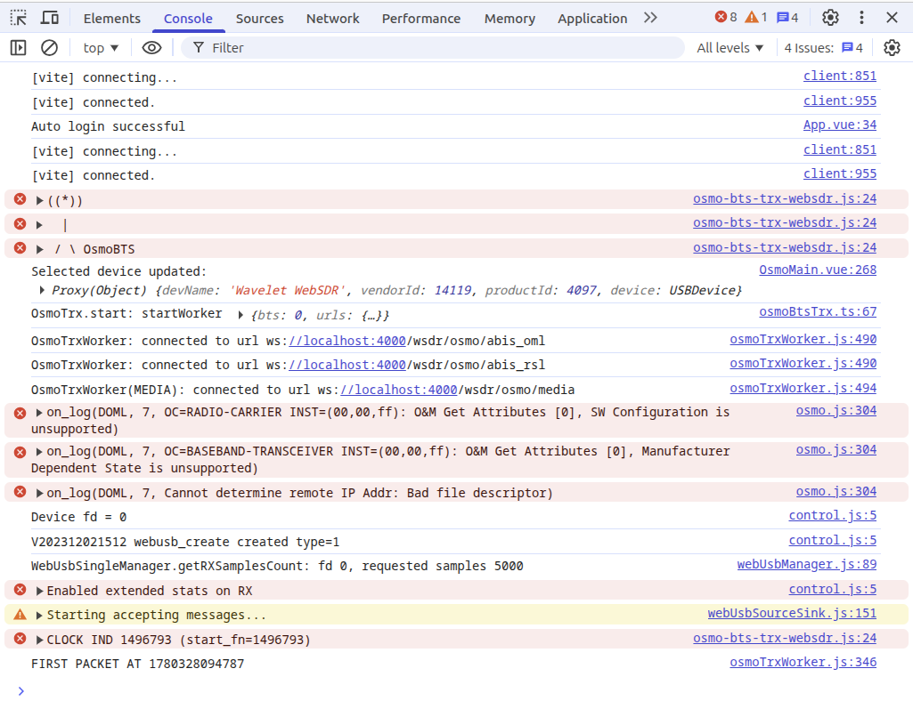
